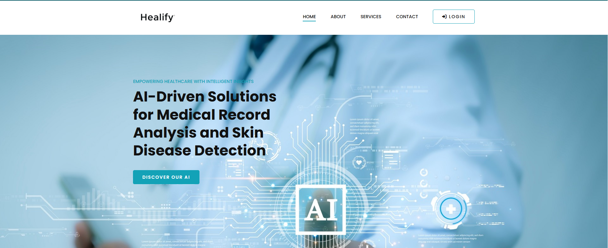
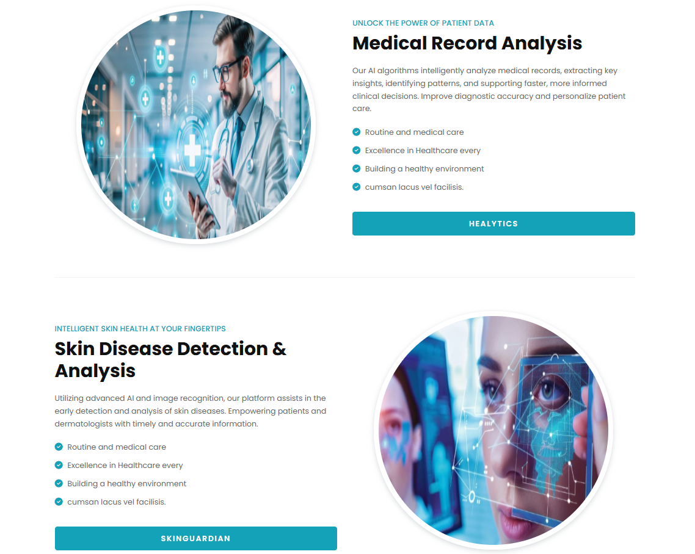

# 🏥 Healify — Smart Healthcare Assistant Powered by AI

**Healify** is a web-based healthcare assistant that leverages modern Artificial Intelligence techniques to help users better understand medical information and access intelligent health support.  
The platform combines medical report interpretation, interactive medical chat, and AI-based skin condition analysis in one unified solution.

Our mission is simple: **make medical data more understandable, accessible, and actionable for everyone**.

---

## 🚀 Key Capabilities

Healify is built around several AI-driven modules, each designed to address a specific healthcare need.

---

### 🧠 Healytics — Medical Report Simplification

- **Purpose:** Translate complex medical reports into clear, patient-friendly explanations.
- **Model:** Fine-tuned `meta-llama/Llama-3.2-1B-Instruct` using **LoRA**.
- **Data Approach:** Synthetic medical notes generated from structured, de-identified **MIMIC-III** records.
- **Workflow:**  
  PDF upload → text extraction → simplified explanation generated by the fine-tuned LLM.

---

### 💬 HealyChat — Medical Question Answering with RAG

- **Purpose:** Answer user questions based on uploaded medical documents.
- **Architecture:** Retrieval-Augmented Generation (RAG).

**Why RAG?**
- Minimizes hallucinations  
- Grounds answers in user-provided data  
- Enables document-aware and context-specific responses  

---

### 📸 SkinGuard — Skin Disease Image Classification

- **Purpose:** Assist early detection of common skin conditions using image analysis.
- **Model:** Custom-built Convolutional Neural Network (CNN).
- **Accuracy:** ~84% on test data.

**Supported Classes:**
- Basal Cell Carcinoma  
- Dermatofibroma  
- Melanoma  
- Nevus  
- Vascular Lesions  

**Use Cases:** Preliminary screening, triage support, and health awareness.

---

### 👩‍⚕️ AI Medical Assistant — DeepSeek Integration

- **Purpose:** Conversational medical assistant for general health questions.
- **Model:** DeepSeek LLM.
- **Features:**
  - General medical explanations  
  - Detailed info about detected skin conditions (symptoms, causes, treatments)

---

## 📊 Data & Model Training Resources

### 🧬 Hugging Face Dataset

🔗 **Healify – Synthetic Medical Notes**  
https://huggingface.co/datasets/Ihssane123/Synthetic_Medical_Notes  

> Dataset card includes preprocessing steps and notebook references.

---

### 📘 Fine-Tuning Notebook

🔗 **LLaMA 3.2 Medical Fine-Tuning (Kaggle)**  
https://www.kaggle.com/code/ihssanened/llama-3-2-1b-instruct-medical-ipynb  

Includes:
- Data loading & preprocessing  
- LoRA configuration  
- Training & evaluation  

---

## 🛠 Technology Stack

- **Frontend:** HTML, CSS, JavaScript  
- **Backend:** Django  
- **AI & ML:**  
  - Fine-tuned LLaMA 3.2 (Healytics)  
  - DeepSeek LLM (Medical Assistant)  
  - Custom CNN (SkinGuard)  
- **Data:** Synthetic medical data, MIMIC-III, Hugging Face

---

## 🖥 Interface Preview

<p align="center">
  
</p>

<p align="center">
  
</p>

---

## 🎥 Project Demo

📌 **Video Demonstration:**  
https://www.linkedin.com/posts/asmae-ajgagal-07bb3a341_ai-healthcareai-llm-ugcPost-7345528723535790082--4gA

📌 **Canva Presentation:**  
https://www.canva.com/design/DAGptZ4ijtA/XHMATOWqoJQhHdVYWSb91Q/view

---

## ⚙️ Local Installation Guide
Follow these steps to run Healify locally:

### 1️. Clone the repository
```bash
git clone https://github.com/AjgagalAsma/Healify.git
cd healify
```
### 2. Create a virtual environment 
```bash
conda env create -f env.yml
```
### 3. Activate the virtual environment
```bash
conda activate heal 
```
### 4. Run the application
```bash
python manage.py runserver 
